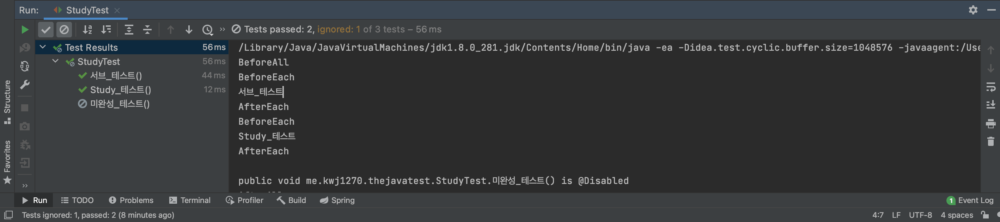

# JUnit5 시작하기 

기존에 존재하는 클래스에 맞추어 테스트 클래스 만들어야 한다.         
이때, **테스트 클래스의 패키지는 원본 클래스와 동일하게 맞춰주는 것이 좋다.**         
**이유는 실제 물리적인 위치는 다르지만, 패키지 수준에서 동일한 접근 권한을 갖게된다.**       
      
예를 들면, `테스트 대상 클래스`에서 디폴트 클래스를 사용하고 있다 가정하겠다.          
기존 `테스트 클래스`의 패키지를 `테스트 대상 클래스`와 동일하게 작성할 경우 접근 가능하지만,   
**패키지를 다르게 작성할 경우 접근 지정자 수준이 맞지 않아 접근하지 못하는 경우가 생긴다.**         
그렇기 때문에, **테스트 클래스의 패키지는 원본 클래스와 동일하게 맞춰주는 것이 좋다.**              

___   

IntelliJ에서는 아주 고마운 기능을 제공한다.     
바로 테스트 클래스와 알맞는 패키지를 자동으로 생성해주는 기능이 있다.     
   
맥북을 기준으로 클래스 선언문 옆에 **`command`**`+`**`Shift`**`+`**`T`** 를 누르면 된다.    

```java
package me.kwj1270.thejavatest;

import org.junit.jupiter.api.*;

import static org.junit.jupiter.api.Assertions.*;

class StudyTest {

    @Test
    public void Study_테스트() {
        Study study = new Study();
        assertNotNull(study);
        System.out.println("Study_테스트");
    }

    @Test
    public void 서브_테스트() {
        System.out.println("서브_테스트");
    }

    @Disabled
    @Test
    public void 미완성_테스트() {
        System.out.println("미완성_테스트");
    }

    @BeforeAll
    static void BeforeAll_테스트() {
        System.out.println("BeforeAll");
    }

    @BeforeEach
    public void BeforeEach_테스트() {
        System.out.println("BeforeEach");
    }

    @AfterEach
    public void AfterEach_테스트() {
        System.out.println("AfterEach");
    }

    @AfterAll
    static void AfterAll_테스트() {
        System.out.println("AfterAll");
    }

}

/** 실행 결과 
 * BeforeAll
 * BeforeEach
 * 서브_테스트
 * AfterEach
 * BeforeEach
 * Study_테스트
 * AfterEach
 */
```


각 어노테이션에 대한 설명은 앞서 정리를 했기에 [해당 문서](./README.md#어노테이션)를 참고하자.   
대신 간략히 설명하자면, 

* **@BeforeAll :** 테스트를 실행하기 전에 1번 호출  
* **@BeforeEach :** 테스트 메서드를 실행하기 전에 매번 호출  
* **@AfterEach :** 테스트 메서드를 실행한 후에 매번 호출  
* **@AfterAll :** 테스트를 실행한 후에 1번 호출
* **@Test :** 테스트를 진행할 메서드 
* **@Disabled :** 전체 테스트 중에 제외할 테스트 메서드 지정    
깨지는 테스트인 경우에, 어떻게 고칠지 모를때 간혹 사용      
          
**@Disabled** 로 지정한 메서드는 사진 왼편에 보면 제외된 것을 알 수 있다.       
       
**🤔 그렇다면 `JUnit4` 기반의 어노테이션을 `Junit5`로 전환해야할까?**        
아니다. `Junit4`로 작성된 코드도 `Junit5`기반으로 잘 작동하니 굳이 바꾸지 않아도 된다.        
 

