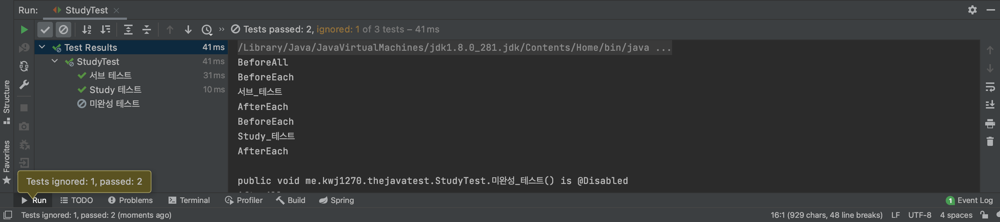
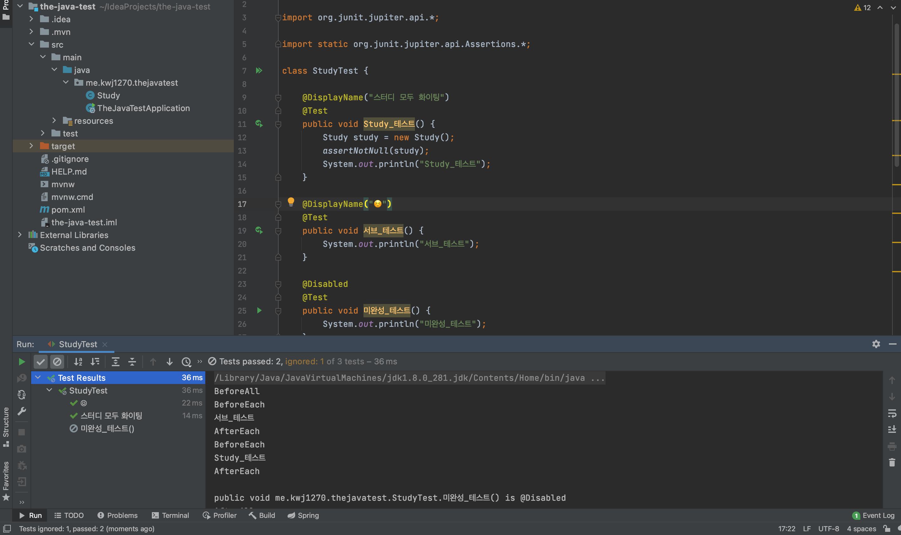

# JUnit5 테스트 이름 표기하기

* `@DisplayNameGeneration` :     
  * Method와 Class 레퍼런스를 사용해서 테스트 이름을 표기하는 방법 설정    
  * 기본 구현체로 ReplaceUnderscores 제공한다.   
* `@DisplayName` :   
  * 어떤 테스트인지 테스트 이름을 보다 쉽게 표현할 수 있는 방법을 제공 
  * `@DisplayNameGeneration` 보다 우선순위가 높다.    
    
이 외에도 JUnit5 문서를 보면 더 다양한 이름짓기 방법들이 있다.   


      
테스트의 이름을 확인하는 방법은 실행 콘솔 왼쪽을 보면 알 수 있다.               
테스트 이름을 표기하는 전략은 기본적으로 테스트 메서드의 이름을 기준으로 진행된다.             
   
하지만, 만약 우리가 이름을 직접 정의하고 싶다면 위에 제시된 어노테이션을 사용하면 된다.      

## @DisplayNameGeneration   
`@DisplayNameGeneration`는 우리가 **전략**을 지정하는 어노테이션이다.   
메서드와 클래스에 사용할 수 있으며 사용 예시는 아래와 같다.  

```java
package me.kwj1270.thejavatest;

import org.junit.jupiter.api.*;

import static org.junit.jupiter.api.Assertions.*;

@DisplayNameGeneration(DisplayNameGenerator.ReplaceUnderscores.class)
class StudyTest {

    @Test
    public void Study_테스트() {
        Study study = new Study();
        assertNotNull(study);
        System.out.println("Study_테스트");
    }

    @Test
    public void 서브_테스트() {
        System.out.println("서브_테스트");
    }

    @Disabled
    @Test
    public void 미완성_테스트() {
        System.out.println("미완성_테스트");
    }

    @BeforeAll
    static void BeforeAll_테스트() {
        System.out.println("BeforeAll");
    }

    @BeforeEach
    public void BeforeEach_테스트() {
        System.out.println("BeforeEach");
    }

    @AfterEach
    public void AfterEach_테스트() {
        System.out.println("AfterEach");
    }

    @AfterAll
    static void AfterAll_테스트() {
        System.out.println("AfterAll");
    }


}
```

    

`@DisplayNameGeneration`의 멤버 값으로는    
`DisplayNameGenerator`클래스에 내부에 존재하는 `static 클래스`의 `Class 타입`을 넣어주면 된다.         
   
|멤버|기능|
|---|---|
|DisplayNameGenerator.ReplaceUnderscores.class|`메서드이름`에서 `_` 및 `()` 제외|
|DisplayNameGenerator.IndicativeSentences.class|`클래스이름`, `메서드이름`으로 표기|
|DisplayNameGenerator.Simple.class|`메서드이름`에서 `()`만 제외|
|DisplayNameGenerator.Standard.class|디폴트 멤버값<br>메서드 이름으로 표기|

앞서 말했듯이, `@DisplayNameGeneration`는 **전략**을 지정하는 것이다.   
그렇기 때문에 개발자가 원하는 이름을 자유롭게 지정할 수는 없다.    

## @DisplayName    
`@DisplayName`은 `@DisplayNameGeneration`와 다르게   
개발자가 원하는 이름을 자유롭게 지정할 수 있다.    

```java
package me.kwj1270.thejavatest;

import org.junit.jupiter.api.*;

import static org.junit.jupiter.api.Assertions.*;

class StudyTest {

    @DisplayName("스터디 모두 화이팅")
    @Test
    public void Study_테스트() {
        Study study = new Study();
        assertNotNull(study);
        System.out.println("Study_테스트");
    }

    @DisplayName("☺️")
    @Test
    public void 서브_테스트() {
        System.out.println("서브_테스트");
    }

    @Disabled
    @Test
    public void 미완성_테스트() {
        System.out.println("미완성_테스트");
    }

    @BeforeAll
    static void BeforeAll_테스트() {
        System.out.println("BeforeAll");
    }

    @BeforeEach
    public void BeforeEach_테스트() {
        System.out.println("BeforeEach");
    }

    @AfterEach
    public void AfterEach_테스트() {
        System.out.println("AfterEach");
    }

    @AfterAll
    static void AfterAll_테스트() {
        System.out.println("AfterAll");
    }


}
```


개발자가 원하는 이름으로 지정해줄 수 있고, 심지어 이모지도 가능하다.   

그렇기에 `@DisplayNameGeneration` 보다는 `@DisplayName`을 사용하는 것을 권장한다.        
테스트 이름을 개발자가 원하는 이름으로 잘 표현할 수 있기 때문이다.          
   
___
추가로,     
   
원하는 테스트 메서드에 마우스 커서를 놓고 **`control`** `+` **`shift`** `+` **`r`** 을 누르면         
해당 테스트 메서드만 실행시킬 수 있다.     
반대로, 마우스 커서를 메서드가 아닌 다른 곳에 놓던가 아에 놓지 않았을 때      
**`control`** `+` **`shift`** `+` **`r`** 을 누르면    
모든 테스트 메서드를 실행시킬 수 있다.   

