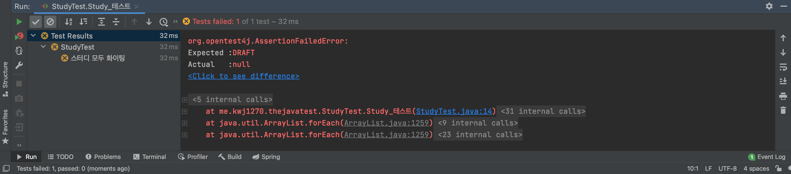
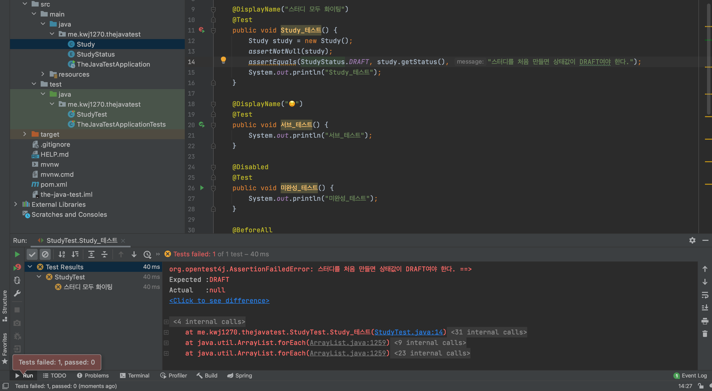

# JUnit5 Assertion    
   
Assertion 은 우리가 실제 테스트에서 검증하고자하는 내용을 확인하는 기능이다.             
코드에서 Assertion은, `org.junit.jupiter.api.Assertions`에 들어있는 `assert-` static 메서드를 말한다.        
`org.junit.jupiter.api.Assertions`의 static 메서드이기에 `import static`을 이용해야 한다.    

## assert- 메서드들
`assert-` 메서드에 대한 내용을 정리하고자 한다.  

|assert- 메서드|설명|
|------------|---|
|assertEquals(expect, actual)|expect와 acutal이 일치하는지 확인한다.|
|assertArrayEquals(expect, actual)|배열 자료형인 expect와 acutal이 일치하는지 확인한다.|    
|assertFalse(condition)|condition이 false 인지 확인한다.|
|assertTrue(condition)|condition이 true 인지 확인한다.|
|assertNull(acutal)|acutal이 null인지 확인한다|
|assertNotNull(acutal)|acutal이 null이 아닌지 확인한다|
|assertSame(expect, actual)|expect와 actual가 같은 객체를 참조하고 있는지 확인한다.| 
|assertNotSame(expect, actual)|expect와 actual가 같은 객체를 참조하고 있지 않은지 확인한다.|
|assertAll(executables...)|()안에 있는 모든 구문이 테스트를 성공하는지 확인한다.|
|assertThrows(expectedType, executable)|예외가 발생하는지 확인한다.|
|assertTimeout(duration, executable)|특정 시간안에 실행이 완료되는지 확인한다.|

`assertEquals()`는 `equals()`메서드를 기준으로 두 객체의 값이 같은지 확인하고,        
`assertSame()`는 `== 연산자`를 기준으로 두 객체의 레퍼런스가 동일한가를 확인한다.        
    
**assert-** 메서드는 파라마터의 순서에따라 의미가 달라지니,        
이를 잘 이해하고 사용하도록 하자 (대부분 처음에 기대값, 실제값)        


## 기본 사용해보기  
`assert-` 메서드를 사용하기 위해서 몇 개의 소스 코드를 생성 및 수정하겠다.           
    
**main.me.kwj1270.thejavatest.Study**
```java
package me.kwj1270.thejavatest;

public class Study {
    private StudyStatus studyStatus;

    public StudyStatus getStatus() {
        return this.studyStatus;
    }
}
```
* Study의 상태를 나타내는 `StudyStatus 열거형`을 인스턴스 변수로 넣었다.      

**main.me.kwj1270.thejavatest.StudyStatus**    
```java
package me.kwj1270.thejavatest;
public enum StudyStatus {
    DRAFT, STARTED, ENDED;
}
```
* Study의 상태를 나타내는 `StudyStatus 열거형`을 생성했다.  

**test.me.kwj1270.thejavatest**
```java
package me.kwj1270.thejavatest;

import org.junit.jupiter.api.*;

import static org.junit.jupiter.api.Assertions.*;

class StudyTest {

    @DisplayName("스터디 모두 화이팅")
    @Test
    public void Study_테스트() {
        Study study = new Study();
        assertNotNull(study);
        assertEquals(StudyStatus.DRAFT, study.getStatus());
        System.out.println("Study_테스트");
    }

    @DisplayName("☺️")
    @Test
    public void 서브_테스트() {
        System.out.println("서브_테스트");
    }

    @Disabled
    @Test
    public void 미완성_테스트() {
        System.out.println("미완성_테스트");
    }

    @BeforeAll
    static void BeforeAll_테스트() {
        System.out.println("BeforeAll");
    }

    @BeforeEach
    public void BeforeEach_테스트() {
        System.out.println("BeforeEach");
    }

    @AfterEach
    public void AfterEach_테스트() {
        System.out.println("AfterEach");
    }

    @AfterAll
    static void AfterAll_테스트() {
        System.out.println("AfterAll");
    }


}
```
* 테스트 클래스에서는 Study의 상태가 `DRAFT`인지 확인한다.     
   

         
위 사진에서 알 수 있듯이      
테스트에 실패하면, 예상값하고 실제값에 대한 정보가 나오면서         
**테스트에 실패한 이유를 어느정도 유추할 수 있다.**          


## 메세지 입력하기
`assert-` 메서드들은 공통적으로 메세지를 입력할 수 있도록 오버로딩 되어있다.             
그렇기에 `assert-` 메서드의 마지막 인자로 메세지를 입력하여 좀 더 쉽게 디버깅할 수 있다.          
현재는 테스트량이 적기에 티가 안날 수 있지만, 현업에서는 무수히 많은 테스트를 진행하므로        
**어느 테스트가 실패했는지 원인은 무엇인지 알기 위해서라도 메세지를 작성하는 것이 좋다.**             

```java
package me.kwj1270.thejavatest;

import org.junit.jupiter.api.*;

import static org.junit.jupiter.api.Assertions.*;

class StudyTest {

    @DisplayName("스터디 모두 화이팅")
    @Test
    public void Study_테스트() {
        Study study = new Study();
        assertNotNull(study);
        assertEquals(StudyStatus.DRAFT, study.getStatus(), "스터디를 처음 만들면 상태값이 DRAFT여야 한다.");
        System.out.println("Study_테스트");
    }

    @DisplayName("☺️")
    @Test
    public void 서브_테스트() {
        System.out.println("서브_테스트");
    }

    @Disabled
    @Test
    public void 미완성_테스트() {
        System.out.println("미완성_테스트");
    }

    @BeforeAll
    static void BeforeAll_테스트() {
        System.out.println("BeforeAll");
    }

    @BeforeEach
    public void BeforeEach_테스트() {
        System.out.println("BeforeEach");
    }

    @AfterEach
    public void AfterEach_테스트() {
        System.out.println("AfterEach");
    }

    @AfterAll
    static void AfterAll_테스트() {
        System.out.println("AfterAll");
    }


}
```
  

**메시지 람다식으로 작성**
```java
package me.kwj1270.thejavatest;

import org.junit.jupiter.api.*;

import static org.junit.jupiter.api.Assertions.*;

class StudyTest {

    @DisplayName("스터디 모두 화이팅")
    @Test
    public void Study_테스트() {
        Study study = new Study();
        assertNotNull(study);
        assertEquals(StudyStatus.DRAFT, study.getStatus(), () -> "스터디를 처음 만들면 상태값이 DRAFT여야 한다.");
        System.out.println("Study_테스트");
    }

    @DisplayName("☺️")
    @Test
    public void 서브_테스트() {
        System.out.println("서브_테스트");
    }

    @Disabled
    @Test
    public void 미완성_테스트() {
        System.out.println("미완성_테스트");
    }

    @BeforeAll
    static void BeforeAll_테스트() {
        System.out.println("BeforeAll");
    }

    @BeforeEach
    public void BeforeEach_테스트() {
        System.out.println("BeforeEach");
    }

    @AfterEach
    public void AfterEach_테스트() {
        System.out.println("AfterEach");
    }

    @AfterAll
    static void AfterAll_테스트() {
        System.out.println("AfterAll");
    }


}
```
```java
assertEquals(Object expected, Object actual, String message)
assertEquals(Object expected, Object actual, Supplier<String> messageSupplier)
```
사실 `assert-` 메서드의 메세지 구문은 대부분 2개의 오버로딩이 존재한다.  
바로, `String`과 `Supplier<String>`으로 되어있다.         
```java
        assertEquals(StudyStatus.DRAFT, study.getStatus(), () -> "스터디를 처음 만들면 상태값이 DRAFT여야 한다.");
```
그 중에 `Supplier<String>` 오버로딩을 이용하고자 한다면 람다식을 사용할 수 있다.    


