# JUnit5 테스트 반복하기    
> 테스트를 반복적으로 실행하는 방법에 대해서 알아보자   
   
주로, 아래와 같은 상황에서 **테스트를 반복적으로 사용한다.**            
     
* 매번 랜덤값을 사용한다.                
* 실행되는 타이밍에 따라 조건이 달라진다.                   

# @RepeatedTest
`@RepeatedTest`는 반복 횟수와 반복 테스트 이름을 설정할 수 있는 테스트이다.    


```java
package me.kwj1270.thejavatest;

import org.junit.jupiter.api.*;

import static org.assertj.core.api.Assertions.*;

class StudyTest {

    @RepeatedTest(10)
    void 반복_테스트() {
        System.out.println("test");
    }

}
```   
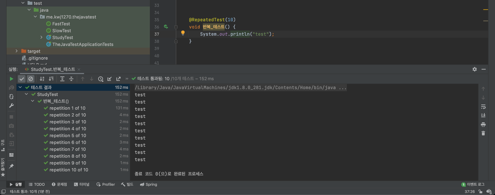     


`@RepeatedTest()`에 `value 멤버`에 **`int`형 정수**를 입력하면       
입력한 숫자만큼 테스트를 반복하도록 동작시킨다.      
그리고 `value`멤버는 어노테이션 문법상 생략가능하므로 주로, 정수만 입력한다.        

```java
package me.kwj1270.thejavatest;

import org.junit.jupiter.api.*;

import static org.assertj.core.api.Assertions.*;

class StudyTest {

    @RepeatedTest(10)
    void 반복_테스트(RepetitionInfo repetitionInfo) {
        System.out.println("test" + repetitionInfo.getCurrentRepetition()+"/"+repetitionInfo.getTotalRepetitions());
    }

}
```   
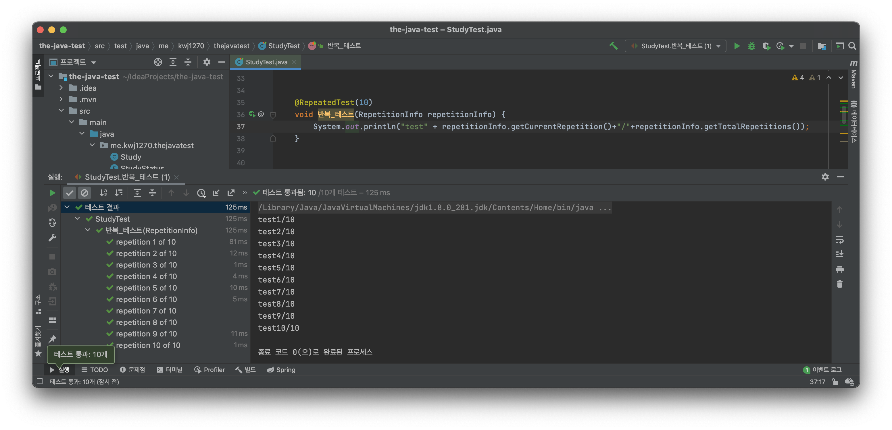    
   
   
`@RepeatedTest`를 선언한 테스트 메서드는              
`RepetitionInfo` 인스턴스를 매개변수로 받아 사용할 수 있다.        

`RepetitionInfo`은 인터페이스로 아래와 같은 2가지 추상 메서드를 가진다.    

* `int getCurrentRepetition()` : 반복중인 **현재 횟수**를 리턴한다.       
* `int getTotalRepetitions()` : 반복되어야할 **전체 횟수**를 리턴한다.     
      
구현체가 무엇인지는 자세히 알 수 없었지만,        
이를 통해, 테스트 로직에 반복에 대한 현재 횟수와, 전체 횟수를 사용할 수 있다.    
  
```java
package me.kwj1270.thejavatest;

import org.junit.jupiter.api.*;

import static org.assertj.core.api.Assertions.*;

class StudyTest {

    @DisplayName("반복_테스트")
    @RepeatedTest(value = 10, name = "{displayName}, {currentRepetition}/{totalRepetitions}")
    void 반복_테스트(RepetitionInfo repetitionInfo) {
        System.out.println("test" + repetitionInfo.getCurrentRepetition()+"/"+repetitionInfo.getTotalRepetitions());
    }

}    
```  
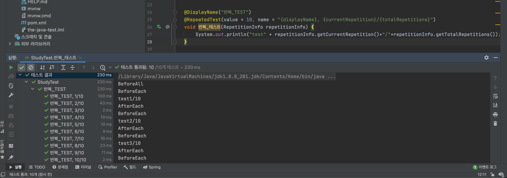       
       
`@RepeatedTest`의 멤버로는 `value`외에도 `name`이 존재한다.          
`@RepeatedTest`의 `name`을 선언할 경우 `@DisplayName`처럼 **반복 테스트의 이름을 정의할 수 있다.**      
      
기본적으로 **문자열을 사용할 수 있으며** 추가로, `{}`값을 사용할 수 있다.       
   
* **`{displayName}` :** 메서드의 이름을 나타내며 `@DisplayName`이 있을 경우 어노테이션에 정의된 이름을 우선시한다.        
* **`{currentRepetition}` :** 현재 반복 횟수를 나타내며 1부터 시작한다. 
* **`{totalRepetitions}` :** 전체 반복할 횟수를 나타낸다.    
     
`name`의 디폴트 값으로는 `"repetition {currentRepetition} of {totalRepetitions}"`이 들어있다.   

    
# @ParameterizedTest      
`@ParameterizedTest`는 테스트에 여러 다른 매개변수를 대입해가며 반복적으로 실행한다.       
`JUnit4`에서는 써드파티 라이브러리에서 불러와 사용했지만,       
`JUnit5`에서 부터 기본으로 제공해주기 시작했다.           
      
```java
package me.kwj1270.thejavatest;

import org.junit.jupiter.api.*;
import org.junit.jupiter.params.ParameterizedTest;
import org.junit.jupiter.params.provider.ValueSource;

import static org.assertj.core.api.Assertions.*;

class StudyTest {

    @ParameterizedTest
    @ValueSource(strings = {"날씨가", "많이", "추워지고", "있네요"})
    void ParameterizedTest(String message) {
        System.out.println(message);
    }

}
```
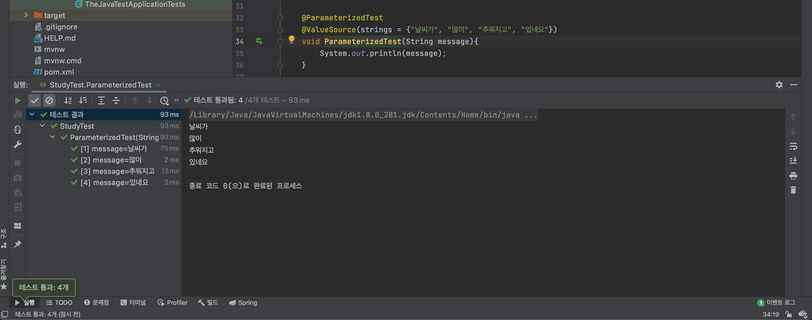   
     
`@ParameterizedTest`를 사용하면 메서드의 파라미터에 인자값을 넣어줄 수 있는 어노테이션들이 사용가능하다.          
`@ValueSource` 같은 경우 파라미터에 단일 인자값을 순서대로 넘겨주는 역할을 하고 있다.            
   
```java
package me.kwj1270.thejavatest;

import org.junit.jupiter.api.*;
import org.junit.jupiter.params.ParameterizedTest;
import org.junit.jupiter.params.provider.ValueSource;

import static org.assertj.core.api.Assertions.*;

class StudyTest {

    @DisplayName("파라미터_TEST")
    @ParameterizedTest(name = "{index} {displayName} {0}")
    @ValueSource(strings = {"날씨가", "많이", "추워지고", "있네요"})
    void ParameterizedTest(String message) {
        System.out.println(message);
    }

}

```
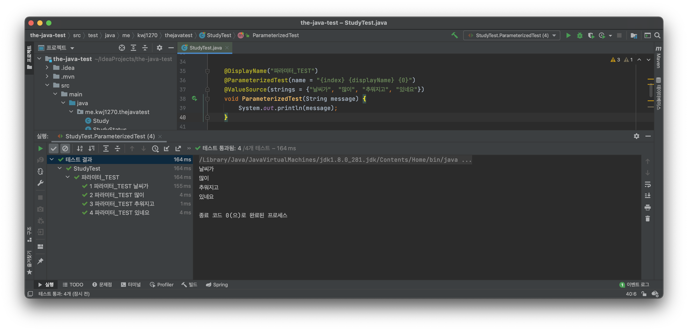    
  
  
`@ParameterizedTest`의 멤버로 `name`이 존재한다.          
`@ParameterizedTest`의 `name`을 선언할 경우 `@DisplayName`처럼 **반복 테스트의 이름을 정의할 수 있다.**         
         
* **`{displayName}` :** 메서드의 이름을 나타내며 `@DisplayName`이 있을 경우 어노테이션에 정의된 이름을 우선시한다.      
* **`{index}` :** 현재 반복 횟수를 나타내며 1부터 시작한다.                
* **`{arguments}` :** 파라미터로 들어오는 모든 값들을 한번에 출력한다.(여러 매개변수들을 한번에)             
* **`{0}`, `{1}`, `...` :** 파라미터로 들어오는 값들을 정의된 순서에 맞게끔 가져오며 0부터 시작한다.        
* **`{argumentsWithNames}` :** 매개변수의 이름과 값을 `이름=값` 형태로 한번에 표현한다.              
    
`name`의 디폴트 값으로는 `default "[{index}] {argumentsWithNames}"`이 들어있다.     

```java
package me.kwj1270.thejavatest;

import org.junit.jupiter.api.*;
import org.junit.jupiter.params.ParameterizedTest;
import org.junit.jupiter.params.provider.*;

import static org.assertj.core.api.Assertions.*;

class StudyTest {

    @DisplayName("파라미터_TEST")
    @ParameterizedTest(name = "{index} {displayName} {0}")
    @ValueSource(strings = {"10", "20", "30"})
    void ParameterizedTest(int number){
        System.out.println("암묵적 형변환 : "+ new Study(number).getLimit());
    }

} 
```    
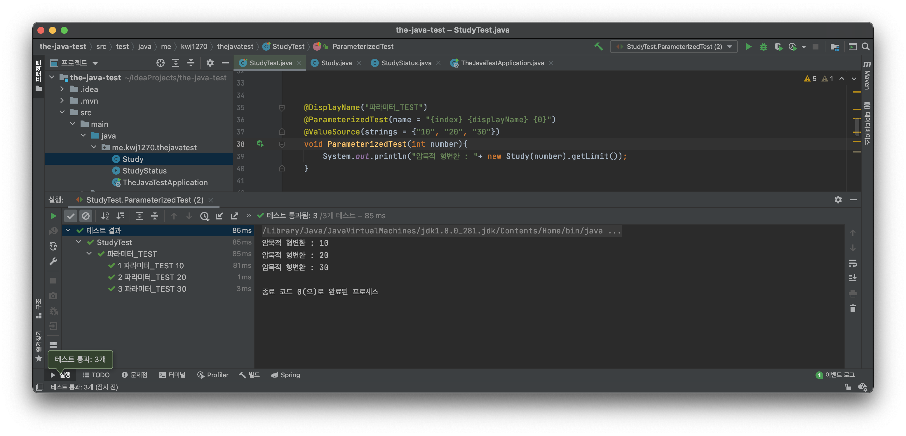    
   
그리고, 인자로 들어올 값을 특정 클래스에 주입시켜 특정 클래스의 인스턴스를 가져올 수 있다.       
`ParameterizedTest`에서는 원래 `int` 값을 파라미터의 인자로 보내지만,          
`Study` 클래스에서 해당 값을 가지고 인스턴스를 생성하고 이를 파라미터의 인자로 보내고 있다.          

위 코드와 같이 특정 조건에 만족하면 `int 인자값`의 타입을 `Study 인자값`으로 바꿔줄 수 있으며   
이처럼 인자값의 타입을 변환해주는 인터페이스가 존재함으로 [레퍼런스](https://junit.org/junit5/docs/current/user-guide/#writing-tests-parameterized-tests-argument-conversion-implicit)를 참고하자    
(예를 들면, `Sting 타입의 "true"`를 `Boolean 타입의 true`로 바꿔준다.)      
          
## @ConvertWith 와 SimpleArgumentConvertor         
만약, 인자 값 변환을 Junit5 에서 제공하는 문법. 즉, 암묵적 형변환이 아닌,     
커스텀한 타입으로 변환. 죽, 명시적 형변환을 하고 싶다면 `@ConvertWith`을 사용할 수 있다.    

```java
package me.kwj1270.thejavatest;

import org.junit.jupiter.api.*;
import org.junit.jupiter.params.ParameterizedTest;
import org.junit.jupiter.params.converter.ArgumentConversionException;
import org.junit.jupiter.params.converter.ConvertWith;
import org.junit.jupiter.params.converter.SimpleArgumentConverter;
import org.junit.jupiter.params.provider.*;

import static org.assertj.core.api.Assertions.*;
import static org.junit.jupiter.api.Assertions.*;

class StudyTest {
  
    @DisplayName("파라미터_TEST")
    @ParameterizedTest(name = "{index} {displayName} {0}")
    @ValueSource(ints = {10, 20, 30})
    void ParameterizedTest(@ConvertWith(StudyConvertor.class) Study study) {
        System.out.println(study.getLimit());
    }

    static class StudyConvertor extends SimpleArgumentConverter {

        @Override
        protected Object convert(Object source, Class<?> targetType) throws ArgumentConversionException {
            assertEquals(Study.class, targetType, "can only convert to Study");
            return new Study(Integer.parseInt(source.toString()));
        }
    }

}
```
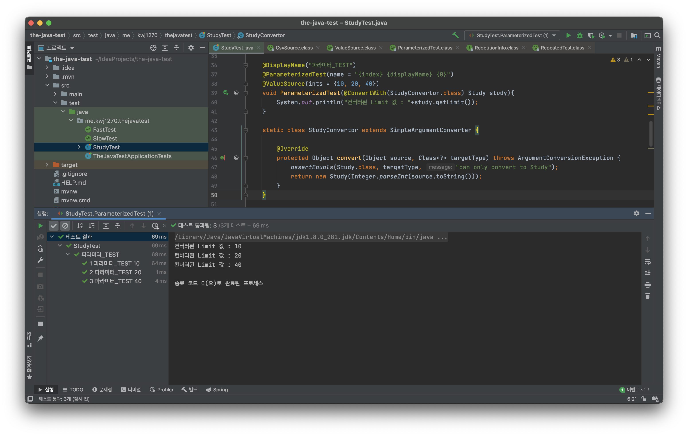        
  
    
`@ConvertWith`를 사용하기전에 `SimpleArgumentConverter`를 상속한 `Convertor`클래스가 필요하다.       
단, `SimpleArgumentConverter`를 상속한 `Convertor`클래스의 작업은 단일 인자에 대해서만 동작한다.        
즉, 하나의 `Argument`에만 적용되어 다른 타입으로 변환시키는 작업이여서 여러 인자에 대해 동작시킬수는 없다.              

# @CsvSource
기존, `@ValueSource`는 테스트 메서드 파라미터에 **하나의 인자값만 넣을 수 있다.**         
    
```java
package me.kwj1270.thejavatest;

import org.junit.jupiter.api.*;
import org.junit.jupiter.params.ParameterizedTest;
import org.junit.jupiter.params.converter.ArgumentConversionException;
import org.junit.jupiter.params.converter.ConvertWith;
import org.junit.jupiter.params.converter.SimpleArgumentConverter;
import org.junit.jupiter.params.provider.*;

import static org.assertj.core.api.Assertions.*;
import static org.junit.jupiter.api.Assertions.*;

class StudyTest {

    @DisplayName("파라미터_TEST")
    @ParameterizedTest(name = "{index} {displayName} {0}")
    @ValueSource(strings = {"날씨가", "많이", "추워지고", "있네요"}, booleans = {true, false, true, false})
    void ParameterizedTest2(String name, boolean is) {
        System.out.println(name+is);
    }

}
```
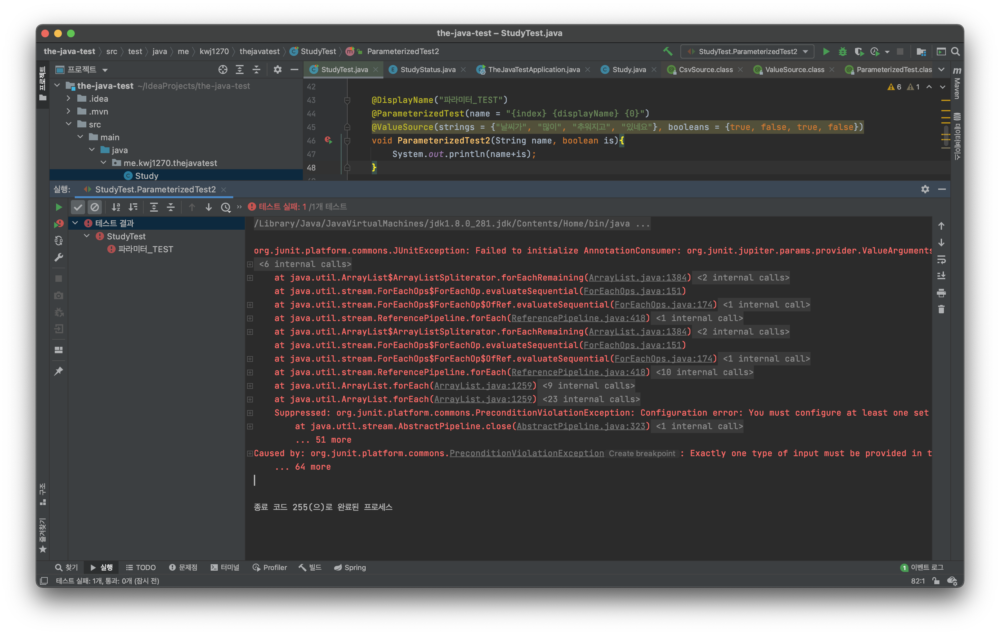       
          
그렇기에 `@ValueSource`는 테스트 메서드에 **여러 인자를 받아와 사용하고자 한다면, 에러를 발생시킨다.**                   
      
## 일반적인 `@CsvSource` 사용
   
`@CsvSource` 는 `@ValueSource`와는 다르게 하나의 **테스트 메스드에 여러 인자값을 넘겨줄 수 있다.**           
         
**main.java.me.kwj1270.thejavatest.Study.java**
```java
package me.kwj1270.thejavatest;

public class Study {
    private StudyStatus studyStatus;

    private int limit;

    private String name;

    public Study(int limit){
        if(limit < 0) throw new IllegalArgumentException("limit은 0보다 커야한다.");
        this.limit = limit;
    }

    public Study(int limit, String name){
        if(limit < 0) throw new IllegalArgumentException("limit은 0보다 커야한다.");
        this.limit = limit;
        this.name = name;
    }

    public StudyStatus getStatus() {
        return this.studyStatus;
    }

    public int getLimit() {
        return this.limit;
    }

    public String getName() {
        return this.name;
    }

    @Override
    public String toString() {
        return "Study{" +
                "studyStatus=" + studyStatus +
                ", limit=" + limit +
                ", name='" + name + '\'' +
                '}';
    }
}
```
```java
package me.kwj1270.thejavatest;

import org.junit.jupiter.api.*;
import org.junit.jupiter.params.ParameterizedTest;
import org.junit.jupiter.params.converter.ArgumentConversionException;
import org.junit.jupiter.params.converter.ConvertWith;
import org.junit.jupiter.params.converter.SimpleArgumentConverter;
import org.junit.jupiter.params.provider.*;

import static org.assertj.core.api.Assertions.*;
import static org.junit.jupiter.api.Assertions.*;

class StudyTest {

    @DisplayName("파라미터_TEST")
    @ParameterizedTest(name = "{index} {displayName} {0}")
    @CsvSource({"10, '자바 스터디'", "20, 스프링"})
    void ParameterizedTest(Integer limit, String name){
        System.out.println(new Study(limit, name));
    }

}
```


* `@CsvSource`을 이용해서 여러개의 그리고 다양한 타입의 인자를 받아왔다.     


## ArgumentsAccessor 사용
```java
package me.kwj1270.thejavatest;

import org.junit.jupiter.api.*;
import org.junit.jupiter.params.ParameterizedTest;
import org.junit.jupiter.params.aggregator.ArgumentsAccessor;
import org.junit.jupiter.params.converter.ArgumentConversionException;
import org.junit.jupiter.params.converter.SimpleArgumentConverter;
import org.junit.jupiter.params.provider.*;

import static org.assertj.core.api.Assertions.*;
import static org.junit.jupiter.api.Assertions.*;

class StudyTest {

    @DisplayName("파라미터_TEST")
    @ParameterizedTest(name = "{index} {displayName} {0}")
    @CsvSource({"10, '자바 스터디'", "20, 스프링"})
    void ParameterizedTest(ArgumentsAccessor argumentsAccessor) {
        Study study = new Study(argumentsAccessor.getInteger(0), argumentsAccessor.getString(1));
        System.out.println(study);
    }

}
```
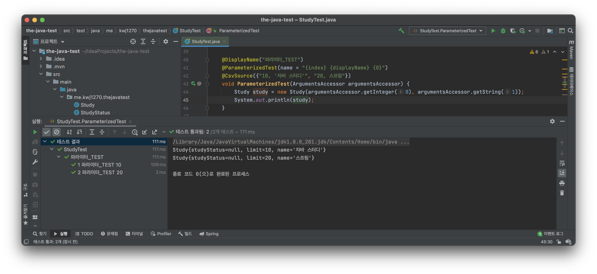           
  
* `ArgumentsAccessor` 클래스를 이용하면 인자 값을 한번에 읽어서 처리할 수 있다.        
* `getter`에 들어오는 인덱스와 순서는 0부터 시작하여 `@CsvSource`정의된 순서로 분류된다.     


## ArgumentsAggregator 사용
```java
package me.kwj1270.thejavatest;

import org.junit.jupiter.api.*;
import org.junit.jupiter.api.extension.ParameterContext;
import org.junit.jupiter.params.ParameterizedTest;
import org.junit.jupiter.params.aggregator.AggregateWith;
import org.junit.jupiter.params.aggregator.ArgumentsAccessor;
import org.junit.jupiter.params.aggregator.ArgumentsAggregationException;
import org.junit.jupiter.params.aggregator.ArgumentsAggregator;
import org.junit.jupiter.params.converter.ArgumentConversionException;
import org.junit.jupiter.params.converter.SimpleArgumentConverter;
import org.junit.jupiter.params.provider.*;

import static org.assertj.core.api.Assertions.*;
import static org.junit.jupiter.api.Assertions.*;

class StudyTest {

    @DisplayName("파라미터_TEST")
    @ParameterizedTest(name = "{index} {displayName} {0}")
    @CsvSource({"10, '자바 스터디'", "20, 스프링"})
    void ParameterizedTest(@AggregateWith(StudyAggregator.class) Study study){
        System.out.println(study);
    }

    static class StudyAggregator implements ArgumentsAggregator {

        @Override
        public Object aggregateArguments(ArgumentsAccessor argumentsAccessor, ParameterContext parameterContext) throws ArgumentsAggregationException {
            return new Study(argumentsAccessor.getInteger(0), argumentsAccessor.getString(1));
        }
    }

}
```
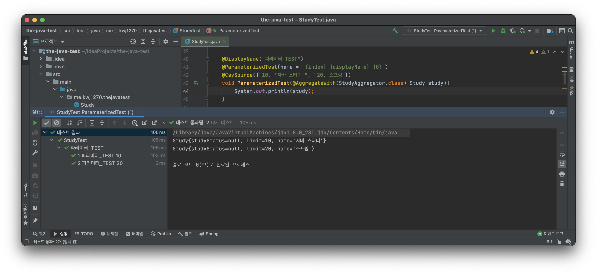    

* `ArgumentsAggregator` 인터페이스를 구현한 `Aggregator`클래스를 통해 명시적 형변환을 수행했다.        
* `ArgumentsAggregator` 생성에는 조건이 있는데 구현클래스가 `static inner 클래스`이거나, `public 클래스`이어야 한다.        
* 이후, 파라미터에 `@AggregateWith(Aggregator_구현클래스.class)`를 사용하여 형변환을 시킬 수 있다.    
      
 
# @NullAndEmptySource
`@NullAndEmptySource`는 테스트 케이스에        
`null 값을 가진 인자`와 `아무런 값을 가지지 않은 인자`값을 추가하는 어노테이션이다.            

```java
package me.kwj1270.thejavatest;

import org.junit.jupiter.api.*;
import org.junit.jupiter.api.extension.ParameterContext;
import org.junit.jupiter.params.ParameterizedTest;
import org.junit.jupiter.params.aggregator.AggregateWith;
import org.junit.jupiter.params.aggregator.ArgumentsAccessor;
import org.junit.jupiter.params.aggregator.ArgumentsAggregationException;
import org.junit.jupiter.params.aggregator.ArgumentsAggregator;
import org.junit.jupiter.params.converter.ArgumentConversionException;
import org.junit.jupiter.params.converter.SimpleArgumentConverter;
import org.junit.jupiter.params.provider.*;

import static org.assertj.core.api.Assertions.*;
import static org.junit.jupiter.api.Assertions.*;

class StudyTest {

    @DisplayName("파라미터_TEST")
    @ParameterizedTest(name = "{index} {displayName} {0}")
    @NullAndEmptySource
    @ValueSource(strings = {"날씨가", "많이", "추워지고", "있네요"})
    void ParameterizedTest(String message) {
        System.out.println(message);
    }

}
```
          
                
실행 결과를 보면 알 수 있듯이 `@NullAndEmptySource`을 통해            
`null 값을 가진 인자`와 `아무런 값을 가지지 않은 인자`값을 가진 테스트 케이스가 추가되었다.            

```java
package me.kwj1270.thejavatest;

import org.junit.jupiter.api.*;
import org.junit.jupiter.api.extension.ParameterContext;
import org.junit.jupiter.params.ParameterizedTest;
import org.junit.jupiter.params.aggregator.AggregateWith;
import org.junit.jupiter.params.aggregator.ArgumentsAccessor;
import org.junit.jupiter.params.aggregator.ArgumentsAggregationException;
import org.junit.jupiter.params.aggregator.ArgumentsAggregator;
import org.junit.jupiter.params.converter.ArgumentConversionException;
import org.junit.jupiter.params.converter.SimpleArgumentConverter;
import org.junit.jupiter.params.provider.*;

import static org.assertj.core.api.Assertions.*;
import static org.junit.jupiter.api.Assertions.*;

class StudyTest {

    @DisplayName("파라미터_TEST")
    @ParameterizedTest(name = "{index} {displayName} {0}")
    @ValueSource(strings = {"날씨가", "많이", "추워지고", "있네요"})
    @EmptySource
    @NullSource
    void ParameterizedTest(String message) {
        System.out.println(message);
    }

}
```
사실, `@NullAndEmptySource`는      
내부에 `@NullSource`와 `@EmptySource`을 메타어노테이션으로 사용하는 어노테이션이다.      
그렇기에 아래 사진과 같이 `@NullSource`와 `@EmptySource`을 정의를 해도 똑같은 결과를 얻을 수 있다.     

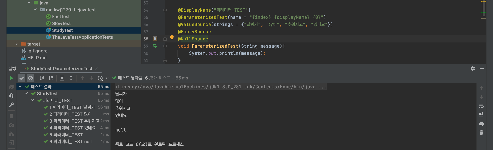    

## @NullSource
`@NullSource`는 인자값으로 `null`을 넘기는 테스트 케이스를 추가하는 어노테이션이다.   

```java
package me.kwj1270.thejavatest;

import org.junit.jupiter.api.*;
import org.junit.jupiter.api.extension.ParameterContext;
import org.junit.jupiter.params.ParameterizedTest;
import org.junit.jupiter.params.aggregator.AggregateWith;
import org.junit.jupiter.params.aggregator.ArgumentsAccessor;
import org.junit.jupiter.params.aggregator.ArgumentsAggregationException;
import org.junit.jupiter.params.aggregator.ArgumentsAggregator;
import org.junit.jupiter.params.converter.ArgumentConversionException;
import org.junit.jupiter.params.converter.SimpleArgumentConverter;
import org.junit.jupiter.params.provider.*;

import static org.assertj.core.api.Assertions.*;
import static org.junit.jupiter.api.Assertions.*;

class StudyTest {

    @DisplayName("파라미터_TEST")
    @ParameterizedTest(name = "{index} {displayName} {0}")
    @ValueSource(strings = {"날씨가", "많이", "추워지고", "있네요"})
    @NullSource
    void ParameterizedTest(String message) {
        System.out.println(message);
    }

}
```
    

  
## @EmptySource  
`@EmptySource`는 인자값으로 아무 값도 넘기지 않는 테스트 케이스를 추가하는 어노테이션이다.      

```java
package me.kwj1270.thejavatest;

import org.junit.jupiter.api.*;
import org.junit.jupiter.api.extension.ParameterContext;
import org.junit.jupiter.params.ParameterizedTest;
import org.junit.jupiter.params.aggregator.AggregateWith;
import org.junit.jupiter.params.aggregator.ArgumentsAccessor;
import org.junit.jupiter.params.aggregator.ArgumentsAggregationException;
import org.junit.jupiter.params.aggregator.ArgumentsAggregator;
import org.junit.jupiter.params.converter.ArgumentConversionException;
import org.junit.jupiter.params.converter.SimpleArgumentConverter;
import org.junit.jupiter.params.provider.*;

import static org.assertj.core.api.Assertions.*;
import static org.junit.jupiter.api.Assertions.*;

class StudyTest {

    @DisplayName("파라미터_TEST")
    @ParameterizedTest(name = "{index} {displayName} {0}")
    @ValueSource(strings = {"날씨가", "많이", "추워지고", "있네요"})
    @EmptySource
    void ParameterizedTest(String message) {
        System.out.println(message);
    }

}
```
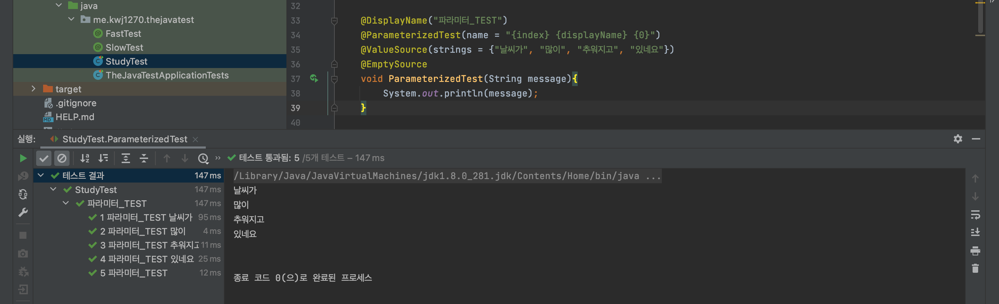    

# 이외에도..
`@CvsFileSource`와 `@ArgumentSource` 이 존재하는데 나중에 다시 정리하겠다.    


