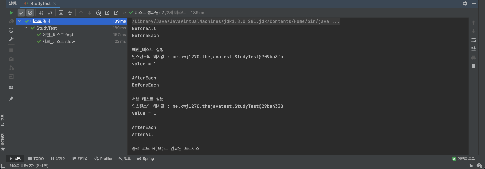
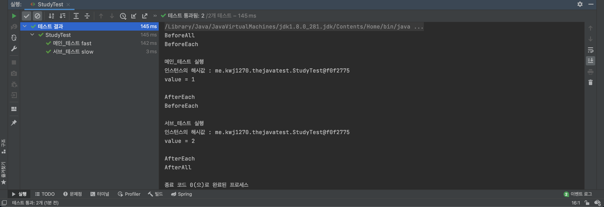

# JUnit5 테스트 인스턴스
       
JUnit의 기본 전략으로 테스트 메서드 마다 테스트 인스턴스를 새로 만든다.          
이는, 테스트 메서드간의 의존성을 낮추기 위한 장치로,          
테스트 메소드를 독립적으로 실행하여 예상치 못한 부작용을 방지하기 위함이다.       

```java
package me.kwj1270.thejavatest;

import org.junit.jupiter.api.*;
import org.junit.jupiter.api.extension.ParameterContext;
import org.junit.jupiter.params.aggregator.ArgumentsAccessor;
import org.junit.jupiter.params.aggregator.ArgumentsAggregationException;
import org.junit.jupiter.params.aggregator.ArgumentsAggregator;
import org.junit.jupiter.params.converter.ArgumentConversionException;
import org.junit.jupiter.params.converter.SimpleArgumentConverter;

import static org.assertj.core.api.Assertions.*;
import static org.junit.jupiter.api.Assertions.*;

class StudyTest {

    int value = 0;

    @FastTest
    @DisplayName("메인_테스트 fast")
    public void 메인_테스트() {
        Study actual = new Study(10);
        assertThat(actual.getLimit()).isGreaterThan(0);
        System.out.println();
        System.out.println("메인_테스트 실행");
        System.out.println("인스턴스의 해시값 : " + this);
        System.out.println("value = " + ++value);
        System.out.println();
    }

    @SlowTest
    @DisplayName("서브_테스트 slow")
    public void 서브_테스트() {
        System.out.println();
        System.out.println("서브_테스트 실행");
        System.out.println("인스턴스의 해시값 : " + this);
        System.out.println("value = " + ++value);
        System.out.println();
    }

    @BeforeAll
    static void BeforeAll_테스트() {
        System.out.println("BeforeAll");
    }

    @BeforeEach
    public void BeforeEach_테스트() {
        System.out.println("BeforeEach");
    }

    @AfterEach
    public void AfterEach_테스트() {
        System.out.println("AfterEach");
    }

    @AfterAll
    static void AfterAll_테스트() {
        System.out.println("AfterAll");
    }

}
```
     
             
위 결과에서 보이는 2가지 출력문을 통해           
테스트 메서드 마다 테스트 인스턴스를 새로 만들어 사용한다는 점을 알 수 있다.      
        
* **인스턴스의 해시값이 다르다 :** 가장 명확한 증거로, 메서드를 호출한 인스턴스의 해시값이 다르다.            
* **value의 값이 공유되지 않는다. :** 전위 연산자를 사용했음에도 value 변수는 0을 기준으로 실행되었다.      
             
기본으로 셋팅된 해시값은 인스턴스의 주소를 기준으로 표현되기에        
해시값이 다르다는 것은 일반적으로 서로 다른 메모리에 존재하는 인스턴스라는 것이다.      
또한, 인스턴스 변수 value 의 값은 1로만 출력이 되는데                
이는 테스트 메서드 마다 테스트 인스턴스를 새로 만들어 사용하기 때문이란 것을 알 수 있다.              

```java
    @BeforeAll
    static void BeforeAll_테스트() {
        System.out.println("BeforeAll");
    }

    @AfterAll
    static void AfterAll_테스트() {
        System.out.println("AfterAll");
    }
```
참고로, `@BeforeAll`과 `@AfterAll` 어노테이션을 사용하려면              
어노테이션을 선언한 테스트 메서드에서 `static`을 선언해줘야 했다.             
그 이유도, `@BeforeAll`과 `@AfterAll`는 모든 테스트 과정에서       
딱 1번만 수행해야하기 때문에, 인스턴스 메서드가 아닌 static 정적 메서드로 정의한 것이다.    

# @TestInstance   
             
JUnit5에서 부터는 테스트 인스턴스의 LifeCycle에 대한 설정을 개발자가 할 수 있게 되었다.           

|@TestInstance 멤버|설명|
|-----------------|---|
|TestInstance.Lifecycle.PER_CLASS|기존 전략과 다르게, 테스트 클래스당 테스트 인스턴스를 하나만 만들어 사용한다.<br>`@BeforeAll`과 `@AfterAll`을 선언한 테스트 메서드를<br>인스턴스 메소드 또는 인터페이스에 정의한 default 메소드로 정의할 수 있다.<br>경우에 따라, 테스트 간에 공유하는 모든 상태를 `@BeforeEach` 또는 `@AfterEach`에서 초기화 할 필요가 있다.<br>테스트에 있어 매번 인스턴스를 만들지 않아도 되므로 조금의 성능적 이익을 얻을 수 있다.|   
|TestInstance.Lifecycle.PER_METHOD|`@TestInstance`에 직접적으로 명시되지는 않았지만, JUnit 에서 제공하는 기본 전력이다.<br> 각각의 테스트 메서드마다 테스트 인스턴스를 생성해서 호출한다.|  
    
      
**예시**  
```java
package me.kwj1270.thejavatest;

import org.junit.jupiter.api.*;
import org.junit.jupiter.api.extension.ParameterContext;
import org.junit.jupiter.params.aggregator.ArgumentsAccessor;
import org.junit.jupiter.params.aggregator.ArgumentsAggregationException;
import org.junit.jupiter.params.aggregator.ArgumentsAggregator;
import org.junit.jupiter.params.converter.ArgumentConversionException;
import org.junit.jupiter.params.converter.SimpleArgumentConverter;

import static org.assertj.core.api.Assertions.*;
import static org.junit.jupiter.api.Assertions.*;

@TestInstance(TestInstance.Lifecycle.PER_CLASS)
class StudyTest {

    int value = 0;

    @FastTest
    @DisplayName("메인_테스트 fast")
    public void 메인_테스트() {
        Study actual = new Study(10);
        assertThat(actual.getLimit()).isGreaterThan(0);
        System.out.println();
        System.out.println("메인_테스트 실행");
        System.out.println("인스턴스의 해시값 : " + this);
        System.out.println("value = " + ++value);
        System.out.println();
    }

    @SlowTest
    @DisplayName("서브_테스트 slow")
    public void 서브_테스트() {
        System.out.println();
        System.out.println("서브_테스트 실행");
        System.out.println("인스턴스의 해시값 : " + this);
        System.out.println("value = " + ++value);
        System.out.println();
    }

    @BeforeAll
    void BeforeAll_테스트() {
        System.out.println("BeforeAll");
    }

    @BeforeEach
    public void BeforeEach_테스트() {
        System.out.println("BeforeEach");
    }

    @AfterEach
    public void AfterEach_테스트() {
        System.out.println("AfterEach");
    }

    @AfterAll
    void AfterAll_테스트() {
        System.out.println("AfterAll");
    }

}
```     
     
          
           
위 결과에서 보이는 2가지 출력문을 통해             
하나의 테스트 인스턴스를 만들어 공유하면서 사용한다는 점을 알 수 있다.         
          
* **인스턴스의 해시값이 같다 :** 가장 명확한 증거로, 메서드를 호출한 인스턴스의 해시값이 같다.           
* **value의 값이 메서드간에 공유된다. :** 전위 연산자를 사용하면서 변경된 value의 값이 다른 메서드에도 반영된다.          
         
앞서 설명했듯이 해시값은 인스턴스의 주소를 기준으로 표현되기에          
동일한 해시값을 출력하는 것은 서로 동일한 메모리에 존재하는 같은 인스턴스를 의미한다.               
또한, 인스턴스 변수 value 의 값도 이전과 다르게 메서드마다 공통으로 사용하고 있다.           
그렇기에 각각의 테스트 메서드가 존재하지만 하나의 인스턴스만 만들어 사용한다는 것을 알 수 있다.        
        
