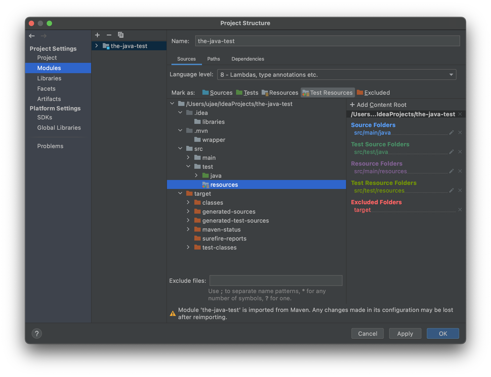

# junit-platform.properties    
                
동일한 설정에서 테스팅을 해야하는 테스트 클래스가 여럿있다고 가정한다.            
어느날, 설정을 바꿔야한다는 오더가 내려와 모든 테스트 클래스를 수정해야 하는 상황이 발생했다.   
          
하지만, 만약 테스트 클래스가 100개, 1000개, 10000개라면?        
그리고 이를 다 수작업으로 작업하다가 누락하거나 잘못된 값을 넣는다면?     
    
어찌보면 이 모든 것은 중복에 의해 발생된 상황이다.    
       
JUnit5 에서는 `properties/yml`을 통해 테스트 클래스에 대한 공통적인 설정을 지원해준다.            
   
# junit-platform.properties 만들기  
   
1. test 디렉터리 하위에 `[new directory]`로 resources 생성            
2. resources 디렉터리 하위에 junit-platform.properties         
        
단, IntelliJ Community를 이용할 경우,          
`resources`에 대해서 `[Test Resources]`디렉토리로 인식을 하지 못하는 경우가 있다.             
이렇게 될 경우 해당 디렉토리를 클래스 패스로 사용을 하지 않기 때문에, 하위 파일들을 읽어오지 못한다.          

    
  
이를 해결하기 위해서는    
`[File]` -> `[Project Structure]` -> `[module]`에서     
`test` 밑에 있는 `resources` 디렉토리를 클릭 후 우측 상단의 `[Test Resources]`로 클릭하여 등록해준다.     

# junit-platform.properties 속성  

