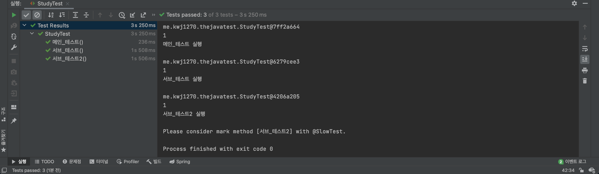
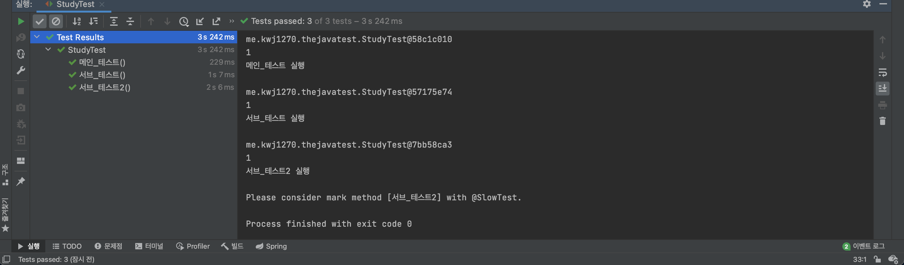

# JUnit5 확장 모델 
              
JUnit5는 JUnit4에 비해서 확장 모델이 단순해졌다고 표현할 수 있다.              
JUnit4의 확장 모델은 `@RunWith(Runner)`, `TestRule`, `MethodRule` 3가지가 존재했다.      
개인적인 궁금증으로 아래에 한 번 정리해보았습니다.   

* **RunWith(Runner) :**   
테스트 실행 방법을 확장할 때 사용하는 어노테이션이다.            
필자 같은 경우는 주로, `SpringRunner.class` 를 사용했던 기억이 있다.             
`SpringRunner.class`를 사용하게 될 경우 스프링 실행자를 실행하여 서버를 구동합니다.           
        
* **Rule(Test/Method) :**   
테스트 케이스를 실행하기 전/후에 추가 코드를 실행할 수 있게 해준다.       
`@Before`와 `@After`가 있지만, 재사용 및 더 확장 가능한 기능으로 개발할 수 있는 장점이 있다.       

____ 
        
JUnit5로 넘어오면서 확장 모델은 단 하나, `Extension`으로 간략화되었다.    
   
**확장을 등록하는 방법**     
* 선언적인 등록 `@ExtendWith`          
* 프로그래밍 등록 `@RegisterExtension`     
* 자동 등록 자바 `ServiceLoader`      
     
**확장을 만드는 방법**   
* 테스트 실행 조건     
* 테스트 인스턴스 팩토리   
* 테스트 인스턴스 후-처리기    
* 테스트 매개변수 리졸버     
* 테스트 라이프사이클 콜백    
* 예외 처리     
* 등등...    

# 실습을 통해 알아보기  
## LifeCycle Callback을 이용한 Extension    
   
실행하는데 오래 걸리는 테스트를 찾는데       
만약 `@Slow` 어노테이션이 없다면 이를 붙이라고 권장하는 `Extension`을 만들어보자    
     
**test.java.me.kwj1270.thejavatest.FindSlowTestExtension 생성**    
```java
package me.kwj1270.thejavatest;

import org.junit.jupiter.api.extension.AfterTestExecutionCallback;
import org.junit.jupiter.api.extension.BeforeTestExecutionCallback;
import org.junit.jupiter.api.extension.ExtensionContext;

import java.lang.reflect.Method;

public class FindSlowTestExtension implements BeforeTestExecutionCallback, AfterTestExecutionCallback {

    private static final long THRESHOLD = 1000L;

    @Override
    public void beforeTestExecution(ExtensionContext extensionContext) throws Exception {
        ExtensionContext.Store store = getStore(extensionContext);
        store.put("START_TIME", System.currentTimeMillis());
    }

    @Override
    public void afterTestExecution(ExtensionContext extensionContext) throws Exception {
        Method testMethod = extensionContext.getRequiredTestMethod();
        SlowTest annotation = testMethod.getAnnotation(SlowTest.class);
        String testMethodName = extensionContext.getRequiredTestMethod().getName();
        ExtensionContext.Store store = getStore(extensionContext);
        long start_Time = store.remove("START_TIME", long.class);
        long duration = System.currentTimeMillis() - start_Time;
        if (duration > THRESHOLD && annotation == null) {
            System.out.printf("Please consider mark method [%s] with @SlowTest.\n", testMethodName);
        }
    }

    private ExtensionContext.Store getStore(ExtensionContext extensionContext) {
        String testClassName = extensionContext.getRequiredTestClass().getName();
        String testMethodName = extensionContext.getRequiredTestMethod().getName();
        ExtensionContext.Store store = extensionContext.getStore(ExtensionContext.Namespace.create(testClassName, testMethodName));
        return store;
    }
}
```   
* **ExtensionContext :**          
`Extension` 클래스를 사용하는 곳에 대한 정보를 가지고 있는 클래스다.            
또한, `Key-Value`와 비슷한 구조로 값들을 저장하는 `Store` 인터페이스가 있다.         

## getStore() 정의하기    

```java
    private ExtensionContext.Store getStore(ExtensionContext extensionContext) {
        String testClassName = extensionContext.getRequiredTestClass().getName();
        String testMethodName = extensionContext.getRequiredTestMethod().getName();
        ExtensionContext.Store store = extensionContext.getStore(ExtensionContext.Namespace.create(testClassName, testMethodName));
        return store;
    }
```
우선 우리는 `Store` 인터페이스의 구현체를 `Extension` 인스턴스의 `getStore()`를 통해 얻어와야 한다.  
`Extension` 인스턴스의 `getStore()`는 `ExtensionContext.NameSpace` 타입이 필요하다.        
다행스럽게도 `ExtensionContext.Namespace` 타입에서 팩토리 메서드 `create()`를 제공해준다.       
`create()`는 `Object` 가변 변수를 통해 받아온 인자들을 합쳐서 `NameSpace` 를 만든다.        
                      
우리는 테스트 클래스 이름과 메서드 이름을 조합한 `NameSpace` 를 만들 예정이다.                     
그렇기에 테스트 클래스 이름과 메서드 이름 또한, `Extension` 인스턴스에서 가져온다.          
이렇게, `NameSpace`를 정의했으므로 이에 대응되는 `Store` 구현체를 하나 생성했다.     
        
## beforeTestExecution 정의하기        
`beforeTestExecution`는 테스트 케이스를 실행하기 전에 동작하는 메서드이다.             

```java
    @Override
    public void beforeTestExecution(ExtensionContext extensionContext) throws Exception {
        ExtensionContext.Store store = getStore(extensionContext);
        store.put("START_TIME", System.currentTimeMillis());
    }
```
우리가 앞서 정의한 `getStore(extensionContext)`를 통해 `Store` 구현체를 가져온다.       
앞서 말했듯이 `Store`는 `Key-Value`와 비슷한 구조를 가진다.        
`Key`의 값으로는 **`"START_TIME"`** 을 `Value`의 값으로는 **현재 시간**을 구해서 넣어준면 된다.       

## afterTestExecution 정의하기   
`afterTestExecution`는 테스트 케이스를 실행한 후에 동작하는 메서드이다.                
    
```java
    @Override
    public void afterTestExecution(ExtensionContext extensionContext) throws Exception {
        Method testMethod = extensionContext.getRequiredTestMethod();
        SlowTest annotation = testMethod.getAnnotation(SlowTest.class);
        String testMethodName = extensionContext.getRequiredTestMethod().getName();
        ExtensionContext.Store store = getStore(extensionContext);
        long start_Time = store.remove("START_TIME", long.class);
        long duration = System.currentTimeMillis() - start_Time;
        if (duration > THRESHOLD && annotation == null) {
            System.out.printf("Please consider mark method [%s] with @SlowTest.\n", testMethodName);
        }
    }
```  
어노테이션을 검사하기 위해 `getRequiredTestMethod`를 통해 리플랙션 Method 객체를 가져온다.         
`Method` 인스턴스의 `getAnnotation(어노테이션.class)`를 통해 어노테이션에 대한 인스턴스를 가져온다.            
이후 `SlowTest` 인스턴스를 검증할 것인데 만약 `null`일 경우 권유 메시지를 출력하도록 할 예정이다.           
          
메시지 출력을 위해, 메서드의 이름을 `Method`인스턴스로부터 가져온다.               
마찬가지로 이전에 사용했던 `Store` 구현체를 사용해야하므로 `getStore(extensionContext)`를 사용한다.            
시간 비교를 위해 기존 `Store` 구현체에 있던 `"START_TIME"`의 값을 `long` 타입으로 빼내면서 삭제한다.          
현재 시간을 구하고 특정 시간이 초과되는지를 검증한다.               
만약, 제한 시간이 초과되었고 어노테이션이 없다면 `@SlowTest`를 붙이는 것을 권장하는 메시지를 출력한다.               
      
# 확장을 등록하는 방법 
## 선언적인 등록 `@ExtendWith`   
```java
@ExtendWith(등록할_클래스.class)
```
`@ExtendWith`를 통해 미리 작성된 `Extension` 구현 클래스를 등록할 수 있다.        
    
```java
package me.kwj1270.thejavatest;

import org.junit.jupiter.api.*;
import org.junit.jupiter.api.extension.ExtendWith;

import static org.assertj.core.api.Assertions.*;

@ExtendWith(FindSlowTestExtension.class)
@TestInstance(TestInstance.Lifecycle.PER_METHOD)
class StudyTest {

    int value = 0;

    @FastTest
    public void 메인_테스트() {
        Study actual = new Study(10);
        assertThat(actual.getLimit()).isGreaterThan(0);
        System.out.println(this);
        System.out.println(++value);
        System.out.println("메인_테스트 실행\n");
    }

    @SlowTest
    public void 서브_테스트() throws InterruptedException {
        Thread.sleep(1000);
        System.out.println(this);
        System.out.println(++value);
        System.out.println("서브_테스트 실행\n");
    }

    @Test
    public void 서브_테스트2() throws InterruptedException {
        Thread.sleep(2000L);
        System.out.println(this);
        System.out.println(++value);
        System.out.println("서브_테스트2 실행\n");
    }

}
```
          
       
사실, 우리가 앞서 구현했던, `BeforeTestExecutionCallback, AfterTestExecutionCallback`는              
`Extension`을 상속하는 (인터페이스간의 상속) 인터페이스였다.                 
그렇기에 `@ExtendWith`를 통해 확장을 등록할 수 있다.         

## 프로그래밍 등록 `@RegisterExtension` 
`@ExtendWith`을 통해 등록을 한다면 선언된 `Extension` 구현체를 커스터마이징 할 수 없다.       
사실, `@ExtendWith`을 사용하면 `Extension` 구현체는 **디폴트 생성자로 만들어진다.**       
즉, 매개변수를 넣어줄 방법이 없기 때문에 커스터마이징할 수 없다는 표현을 사용했다.     
          
`@RegisterExtension`는 실제로 우리가 소스코드 내부에서 프로그래밍을 하는 방식이다.            
`Extension`의 구현체를 **static** 접근 지정자를 통해 생성해야하며         
소스 코드를 통해 객체를 생성하는 것이므로, 필요에 따라 우리가 원하는 생성자를 호출할 수 있다.           
             
**test.java.me.kwj1270.thejavatest.FindSlowTestExtension**    
```java
package me.kwj1270.thejavatest;

import org.junit.jupiter.api.extension.AfterTestExecutionCallback;
import org.junit.jupiter.api.extension.BeforeTestExecutionCallback;
import org.junit.jupiter.api.extension.ExtensionContext;

import java.lang.reflect.Method;

public class FindSlowTestExtension implements BeforeTestExecutionCallback, AfterTestExecutionCallback {
    private long THRESHOLD;

    public FindSlowTestExtension(long THRESHOLD) {
        this.THRESHOLD = THRESHOLD;
    }

    @Override
    public void beforeTestExecution(ExtensionContext extensionContext) throws Exception {
        ExtensionContext.Store store = getStore(extensionContext);
        store.put("START_TIME", System.currentTimeMillis());
    }

    @Override
    public void afterTestExecution(ExtensionContext extensionContext) throws Exception {
        Method testMethod = extensionContext.getRequiredTestMethod();
        SlowTest annotation = testMethod.getAnnotation(SlowTest.class);
        String testMethodName = extensionContext.getRequiredTestMethod().getName();
        ExtensionContext.Store store = getStore(extensionContext);
        long start_Time = store.remove("START_TIME", long.class);
        long duration = System.currentTimeMillis() - start_Time;
        if (duration > THRESHOLD && annotation == null) {
            System.out.printf("Please consider mark method [%s] with @SlowTest.\n", testMethodName);
        }
    }

    private ExtensionContext.Store getStore(ExtensionContext extensionContext) {
        String testClassName = extensionContext.getRequiredTestClass().getName();
        String testMethodName = extensionContext.getRequiredTestMethod().getName();
        ExtensionContext.Store store = extensionContext.getStore(ExtensionContext.Namespace.create(testClassName, testMethodName));
        return store;
    }
}
```
이전과 다르게, `Extension` 구현체가 외부에서 특정 데이터를 입력받는다면?        
우리는 디폴트 생성자만 호출하는 `ExtenedWith`을 사용할 수 없을 것이다.        
    
```java
package me.kwj1270.thejavatest;

import org.junit.jupiter.api.*;
import org.junit.jupiter.api.extension.RegisterExtension;

import static org.assertj.core.api.Assertions.*;

@TestInstance(TestInstance.Lifecycle.PER_METHOD)
class StudyTest {

    int value = 0;

    @RegisterExtension
    static FindSlowTestExtension findSlowTestExtension = new FindSlowTestExtension(1500L);

    @FastTest
    public void 메인_테스트() {
        Study actual = new Study(10);
        assertThat(actual.getLimit()).isGreaterThan(0);
        System.out.println(this);
        System.out.println(++value);
        System.out.println("메인_테스트 실행\n");

    }

    @Test
    public void 서브_테스트() throws InterruptedException {
        Thread.sleep(1500L);
        System.out.println(this);
        System.out.println(++value);
        System.out.println("서브_테스트 실행\n");
    }

    @Test
    public void 서브_테스트2() throws InterruptedException {
        Thread.sleep(1500L);
        System.out.println(this);
        System.out.println(++value);
        System.out.println("서브_테스트2 실행\n");
    }

}
```   
      
          
         
우선, 테스트를 위해 `@RegisterExtension` 말고도 `서브_테스트`를 `@Test`로 선언했다.            
결과를 보면, `1500L`로 제한이 바뀌었기에 `서브_테스트()`에게 메세지가 언급되지 않았음을 알 수 있다.     
      
`@RegisterExtension`를 통해 우리는 다양한 생성자를 호출할 수 있게 되었다.        
그리고 한 가지 더 중요한 점으로 꼭 `Extension` 구현체를 직접 `new` 로 생성하지 않아도 된다.          
빌더나 팩토리를 이용해서 만들어도 인스턴스만 만들면 되기에 상관이 없다.          
  
## 자동 등록 자바 `ServiceLoader` 
**junit-platform.properties**   
```properties
# junit.jupiter.testmethod.order.default=org.junit.jupiter.api.MethodOrderer$OrderAnnotation
# junit.jupiter.testinstance.lifecycle.default=per_class
# junit.jupiter.conditions.deactivate=org.junit.*DisabledCondition
# junit.jupiter.displayname.generator.default=org.junit.jupiter.api.DisplayNameGenerator$ReplaceUnderscores
junit.jupiter.extensions.autodetection.enabled = true
```   
             
`Extension` 구현체를 의존성(dependency)에만 추가해놓고              
`ServiceLoader`를 사용해서 자동으로 감지 및 등록하는 방법이 있다.                 
하지만, 자동으로 감지하는 기능은 기본적으로 설정이 비활성화 되어있다.                  
그렇기에 위와 같은 기능을 사용하고자 한다면             
`junit.jupiter.extensions.autodetection.enabled = true`를 통해 설정을 활성화시키자.         
               
하지만, 이 방법을 사용하기는 매우 까다롭다.                
특정한 포맷에 맞춰야하기 때문에 `META-INF` 안에다가 `services` 디렉터리를 만들고          
`Extension` 구현체의 FQCN을 적어놓은 파일을 만들어서 사용해야한다.          
그리고 명시적으로 `Extension` 구현체를 나타내주지 않기 때문에 사용은 그리 추천하지 않는다.      
     
보다 자세한 내용을 알고 싶다면, [JUnit5 레퍼런스](https://junit.org/junit5/docs/current/user-guide/#extensions)를 확인하자     


