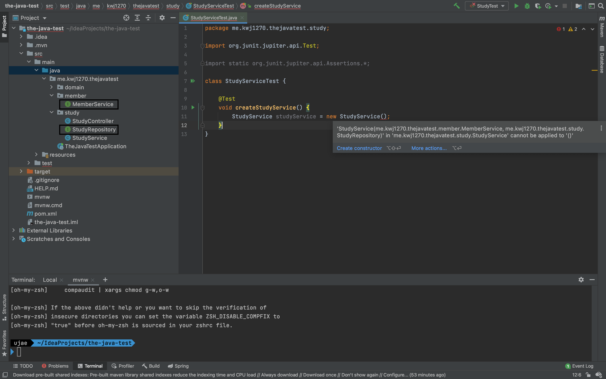
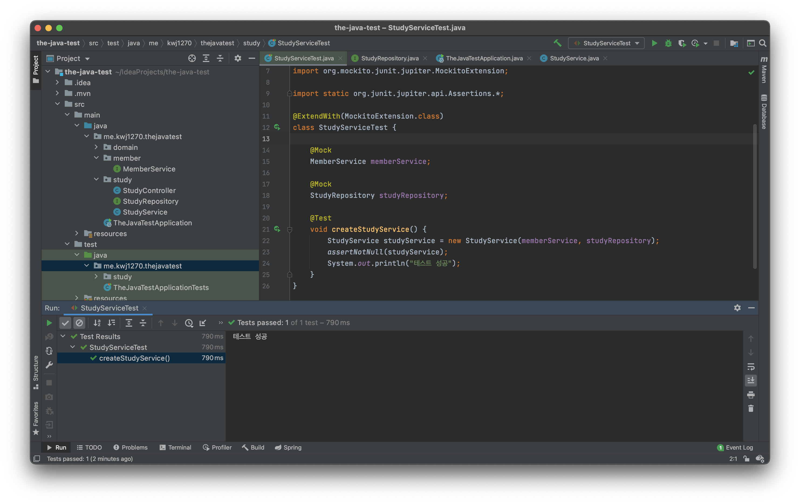

# Mock 객체 만들기   

초기 환경 설정은 [링크](https://github.com/springframework-sprout/THE_JAVA_TEST/blob/main/Mockito/01%20Mockito%20%EC%8B%9C%EC%9E%91%ED%95%98%EA%B8%B0.md#%ED%85%8C%EC%8A%A4%ED%8A%B8%EB%A5%BC-%EC%A7%84%ED%96%89%ED%95%98%EA%B8%B0-%EC%9C%84%ED%95%9C-%EC%B6%94%EA%B0%80-%ED%99%98%EA%B2%BD-%EC%84%A4%EC%A0%95)를 참조

## StudyServiceTest 만들기   
이전 JUnit에서 다루었듯이   
`StudyService` 클래스에서 **`command`**`+`**`shift`**`+`**`t`** 를 눌러 `StudyServiceTest` 클래스를 만든다.      

**src.test.java.me.kwj1270.thejavatest.study**   
```java
package me.kwj1270.thejavatest.study;

import static org.junit.jupiter.api.Assertions.*;

class StudyServiceTest {

}
```

## Mock 사용하기   
`StudyService` 를 테스트하려면 `StudyService` 인스턴스를 만들어야 한다.     
   
```java
package me.kwj1270.thejavatest.study;

import org.junit.jupiter.api.Test;

import static org.junit.jupiter.api.Assertions.*;

class StudyServiceTest {

    @Test
    void createStudyService() {
        StudyService studyService = new StudyService();
    }
}
```


  
new를 이용해 StudyService 인스턴스를 만들고자 하지만 불가능하다.       
`StudyService` 의 생성자는 `MemberService`와 `StudyRepository`의 구현체를 주입 받지만        
위 그림에서 알 수 있듯이 실제로는 인터페이스만 존재하고 이를 구현한 구현체 클래스가 없기 때문이다.    
         
그리고 바로 이러한 상황이 **`Mock`을 사용하기 아주 좋은 예시이다.**          

### mock() 메서드 
**Mock 객체 생성**
```java
package me.kwj1270.thejavatest.study;

import me.kwj1270.thejavatest.member.MemberService;
import org.junit.jupiter.api.Test;
import org.mockito.Mockito;

import static org.junit.jupiter.api.Assertions.*;

class StudyServiceTest {

    @Test
    void createStudyService() {
        MemberService memberService = Mockito.mock(MemberService.class);
        StudyRepository studyRepository = Mockito.mock(StudyRepository.class);
        StudyService studyService = new StudyService(memberService, studyRepository);

        assertNotNull(studyService);
    }
}
```
**import static 방법**   
```java
package me.kwj1270.thejavatest.study;

import me.kwj1270.thejavatest.member.MemberService;
import org.junit.jupiter.api.Test;

import static org.mockito.Mockito.*;
import static org.junit.jupiter.api.Assertions.*;

class StudyServiceTest {

    @Test
    void createStudyService() {
        MemberService memberService = mock(MemberService.class);
        StudyRepository studyRepository = mock(StudyRepository.class);
        StudyService studyService = new StudyService(memberService, studyRepository);

        assertNotNull(studyService);
    }
}
```  
       

`org.mockito.Mockito`의 static 메서드인 `mock()`을 이용하면 손쉽게 Mock객체륾 만들 수 있다.     

### @Mock 어노테이션     
```java
package me.kwj1270.thejavatest.study;

import me.kwj1270.thejavatest.member.MemberService;
import org.junit.jupiter.api.Test;
import org.mockito.Mock;

import static org.junit.jupiter.api.Assertions.*;

@ExtendWith(MockitoExtension.class)
class StudyServiceTest {
    
    @Mock
    MemberService memberService;
    
    @Mock
    StudyRepository studyRepository;
    
    @Test
    void createStudyService() {
        StudyService studyService = new StudyService(memberService, studyRepository);
        assertNotNull(studyService);
        System.out.println("테스트 성공");
    }
}
```   
위와 같이 `@Mock`을 사용하여 `Mock`객체를 만들 수 있다.      
단, `@Mock`이 테스트 환경에서 동작하도록 `@ExtendWith(MockitoExtension.class)`를 붙여주면 된다.    

    
