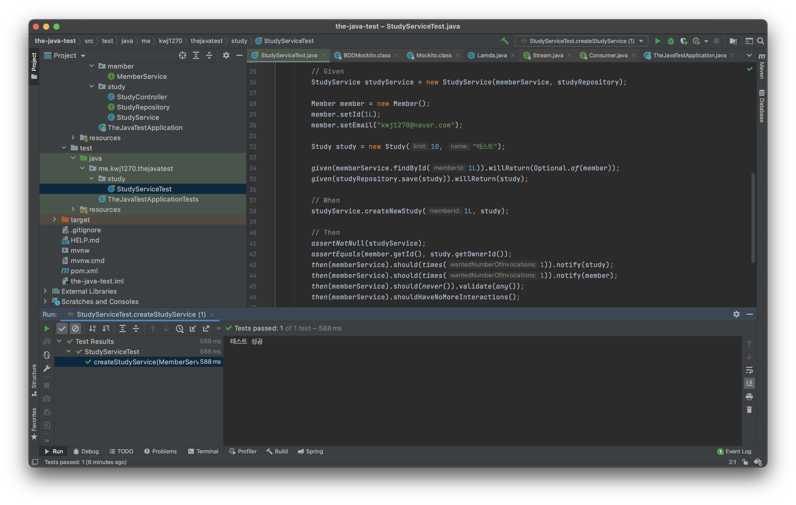

# BDD    
BDD : **애플리케이션이 어떻게 `행동`** 해야 하는지에 대한 공통된 이해를 구성하는 방법이다.          
TDD 에서 창안되었으며, **테스트케이스 자체가 요구사양이 되도록 하는 개발방법이다.**           
     
BDD는 `행동에 대한 스펙`이 핵심이며 주요 요소는 아래와 같다.      

* Title : 
  * 행동에 대한 이름
* Narrative : 
  * 행동에 대한 설명 
  * `AS a` / `I want` / `so that`
  * ~로써, 나는 ~하고 싶다, ~그래서 무엇을 할 것이다.      
  * 예비 개발자로써 나는 뛰어난 개발자가 되고싶다. 그래서 나는 공부를 할 것이다.    
* Acceptance criteria
  * 인수 테스트 관련 작성법  
  * `Given` / `When` / `Then`
  * Given : 어떤 상황들이 주어졌을 때    
  * When : 무엇인가를 하면  
  * Then : 어떤 결과를 나타낼 것이다.   

## BDD 기본 패턴 (Acceptance criteria)  
BDD는 시나리오를  기반으로 테스트 케이스를 작성하며 함수 단위 테스트를 권장하지 않는다.     
이 시나리오는 개발자가 아닌 사람이 봐도 이해할 수 있을 정도의 레벨을 권장한다.    
하나의 시나리오는 `Given, When, Then`구조를 가지는 것으로 기본패턴을 권장한다.     
   
* **Feature :** 테스트에 대상의 기능/책임을 명시합니다
* **Scenario :** 테스트 목적에 대한 상황을 설명합니다
* **Given :** 시나리오 진행에 필요한 값을 설정합니다.
* **When :** 시나리오를 진행하는데 필요한 조건을 명시합니다
* **Then :** 시나리오를 완료했을 때 보장해야 하는 결과를 명시합니다.
    
```java
package me.kwj1270.thejavatest.study;

import me.kwj1270.thejavatest.domain.Member;
import me.kwj1270.thejavatest.domain.Study;
import me.kwj1270.thejavatest.member.MemberService;
import org.junit.jupiter.api.Test;
import org.junit.jupiter.api.extension.ExtendWith;
import org.mockito.Mock;

import static org.mockito.Mockito.*;

import org.mockito.junit.jupiter.MockitoExtension;

import java.util.Optional;

import static org.junit.jupiter.api.Assertions.*;

@ExtendWith(MockitoExtension.class)
class StudyServiceTest {

    @Test
    void createStudyService(@Mock MemberService memberService,
                            @Mock StudyRepository studyRepository) {

        // Given
        StudyService studyService = new StudyService(memberService, studyRepository);

        Member member = new Member();
        member.setId(1L);
        member.setEmail("kwj1270@naver.com");

        Study study = new Study(10, "테스트");
        
        when(memberService.findById(1L)).thenReturn(Optional.of(member));
        when(studyRepository.save(study)).thenReturn(study);

        // When
        studyService.createNewStudy(1L, study);

        // Then
        assertNotNull(studyService);
        assertEquals(member.getId(), study.getOwnerId());
        
        verify(memberService, times(1)).notify(study);
        verify(memberService, times(1)).notify(member);
        verify(memberService, never()).validate(any());
        verifyNoMoreInteractions(memberService);

        System.out.println("테스트 성공");
    }

}
```
이전에 작성했던 코드를 `Given, When, Then` 방식으로 다시 정렬을 시켰다.      
앞선 설명에 더불어 필자가 느낀 `Given, When, Then`은 아래와 같다.   
          
* **Given :** 테스트를 진행하기 위한 준비 과정               
* **When :** 테스틀 수행             
* **Then :** assert 를 통해 테스트 결과를 검증 및 확인        

# Mockito BDD API         
BDD 스타일의 API를 지원해주는 여러 프레임워크가 있다.           
그리고, 우리가 쓰고 있는 `Mockito`에서도 BDD 스타일 API를 지원해준다.      

```java
// Given
when(memberService.findById(1L)).thenReturn(Optional.of(member));
when(studyRepository.save(study)).thenReturn(study);

// Then
verify(memberService, times(1)).notify(study);
verify(memberService, times(1)).notify(member);
verify(memberService, never()).validate(any());
verifyNoMoreInteractions(memberService);
```  
하지만, 앞선 코드에서 보면 무언가 문제가 있다.         
바로 BDD 스타일에 어울리지 않는 메서드 이름을 가지고 있다는 것이다.      
    
`Stubbing`은 특정 메서드의 동작을 정해주는 것이기에 BDD 스타일의 `Given`에 해당한다.      
하지만, Mockito 에서 정의된 메서드는 `when()`이라는 이름을 가지고 있다.       
또한, BDD 스타일의 `Then()`도 `verify()`라는 메서드 이름을 가지고 있다.       

그러면 이같은 메서드의 이름에 맞춰서 `Given, When, Then`을 작성해야 할까?   
아니다. 사실 위에서 기술된 메서드는 단순한 `Mockito` 클래스의 메서드이고  
이런 BDD 스타일을 적용하고자 한다면 `BDDMockito` 클래스의 메서드를 활용하면 된다.  
참고로 `BDDMockito`는 `Mockito` 클래스를 상속받는 하위 클래스여서 `Mockito` 메서드를 그대로 사용가능하다.   

**convert when to given**
```java
// Mockito 클래스 
when(memberService.findById(1L)).thenReturn(Optional.of(member));
when(studyRepository.save(study)).thenReturn(study);


// BDDMockito 클래스 
given(memberService.findById(1L)).willReturn(Optional.of(member));
given(studyRepository.save(study)).willReturn(study);
```
`when()`에서 `given()`으로 convert 하는 과정은 쉽다.         
메서드의 이름을 `given()`으로 그리고 `then-()`메서드들을 `will-()`로 바꾸면 된다.    
   
**convert verify to then**
```java
// Mockito 클래스 
verify(memberService, times(1)).notify(study);
verify(memberService, times(1)).notify(member);
verify(memberService, never()).validate(any());
verifyNoMoreInteractions(memberService);

// BDDMockito 클래스 
then(memberService).should(times(1)).notify(study);
then(memberService).should(times(1)).notify(member);
then(memberService).should(never()).validate(any());
then(memberService).shouldHaveNoMoreInteractions();
```
`verify()`에서 `then()`로 convert 하는 과정 또한 쉽지만 기존 메서드와 살짝 다르다.    
바로, `verify()`의 2번째 인자를 `should()`에서 받도록 따로 뺀 것이다.   
필자 개인적인 느낌으로는 메서드가 명확하게 분리되었다 생각이 들어 더 좋은 것 같다.(개인적 의견)   
     
이 외에도 BDD를 따르려면 테스트(클래스)의 이름도 `should be a ~` 같은 이름을 사용한다.       
하지만, 이 부분은 꼭 컨벤션을 지키려고하기 보다는 본인이 실용적으로 사용하면 될 것 같다.       
    
**전체 소스 코드**
```java
package me.kwj1270.thejavatest.study;

import java.util.Optional;

import me.kwj1270.thejavatest.domain.Member;
import me.kwj1270.thejavatest.domain.Study;
import me.kwj1270.thejavatest.member.MemberService;

import org.junit.jupiter.api.Test;
import org.junit.jupiter.api.extension.ExtendWith;
import org.mockito.Mock;
import org.mockito.junit.jupiter.MockitoExtension;

import static org.mockito.ArgumentMatchers.any;
import static org.mockito.BDDMockito.*;
import static org.junit.jupiter.api.Assertions.*;

@ExtendWith(MockitoExtension.class)
class StudyServiceTest {

    @Test
    void createStudyService(@Mock MemberService memberService,
                            @Mock StudyRepository studyRepository) {

        // Given
        StudyService studyService = new StudyService(memberService, studyRepository);

        Member member = new Member();
        member.setId(1L);
        member.setEmail("kwj1270@naver.com");

        Study study = new Study(10, "테스트");

        given(memberService.findById(1L)).willReturn(Optional.of(member));
        given(studyRepository.save(study)).willReturn(study);

        // When
        studyService.createNewStudy(1L, study);

        // Then
        assertNotNull(studyService);
        assertEquals(member.getId(), study.getOwnerId());
        then(memberService).should(times(1)).notify(study);
        then(memberService).should(times(1)).notify(member);
        then(memberService).should(never()).validate(any());
        then(memberService).shouldHaveNoMoreInteractions();

        System.out.println("테스트 성공");
    }

}
```  
      
    
추가로)       
어떤 기능 설계를 할때(어떤 서비스를 제공하는가) TDD를 작성하는 것도 나쁘지 않다.         
즉, 아직 구체적인 클래스를 정의하지 않았을 때, TDD를 통해서 **행동을 유추하고 이를 클래스로 옮기는 과정**도 괜찮다.       

